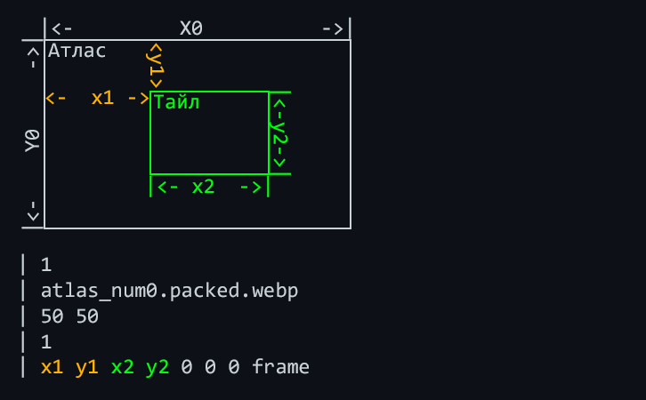

### [< На Главную](../README.md)

---

# 📚 Гайд по работе с WEBP

## Содержание

- [Введение](#введение)
- [Основные понятия](#основные-понятия)
- [Начало работы](#начало-работы)
- [Работа с текстурами](#работа-с-текстурами)
    - [Случай 1: Рядом есть .txt файл](#случай-1-рядом-есть-txt-файл)
    - [Случай 2: .txt файла нет (данные в extr)](#случай-2-txt-файла-нет-данные-в-extr)
- [Заключение](#заключение)

---

## Введение

### Что такое WEBP в Tanks Blitz?

**WEBP** — это современный формат изображений, разработанный компанией Google, который обеспечивает лучшее сжатие по сравнению с традиционными форматами.

В **Tanks Blitz** этот формат используется для хранения текстур `UI`-интерфейса и для частиц от `3D`-эффектов.

> [!IMPORTANT]
> Начиная с версии `12.3` в `Tanks Blitz` для частиц начали использовать формат `.dds` вместо `.webp`. Это будет описано в гайде в формате сносок, так как есть отличия при подключении.

### Утилиты для работы с WEBP

1.  [**DVPL Converter**](https://github.com/qirashi/dvpl_go/releases) — для конвертации файлов в формат `.dvpl` и обратно.
2.  [**riff**](https://github.com/qirashi/dvpl_go/releases) — для распаковки и запаковки блока `extr` внутри `.webp`-файлов, где хранятся данные для игры.
3.  [**Notepad++**](https://notepad-plus-plus.org/downloads) или [**VS Code**](https://code.visualstudio.com) — для удобного редактирования текстовых файлов (`.txt`).
4.  [**Paint.NET**](https://paintnet.ru) — для просмотра и редактирования изображений (`.webp`, `.dds`), а также для получения координат тайлов на атласе.

> [!TIP]
> Вы можете использовать любые аналогичные программы. В этом гайде описана основная суть процесса. Главное — понять принцип и найти максимально удобный метод для себя.

## Основные понятия

*   **`Атлас`** — это единое изображение, которое содержит множество мелких текстур (`тайлов`).
*   **`Тайл`** — небольшая часть изображения, имеющая свою область на общем `атласе`.
*   **`.tex`** — файл с настройками формата для корректного чтения изображений игрой (не используется).
*   **`.txt`** — файл с настройками атласов и тайлов.
*   **`.webp` и `.dds`** — форматы текстур, используемые игрой в `UI` или эффектах.

## Начало работы

Вот простой пример `Изображения`, `Тайла` и `.txt` с настройками:



```yml
1                          # Количество атласов
atlas_num0.packed.webp     # Имя изображения
50 50                      # Размер атласа
1                          # Количество тайлов
x1 y1 x2 y2 x3 y3 N0 frame # Настройки тайла
```

Разберем, что означают параметры в файле и на картинке:

*   `X0 и Y0` — размеры всего изображения, на котором лежат все тайлы.
*   `x1 и y1` — смещение тайла на изображении от левого верхнего угла в пикселях.
*   `x2 и y2` — размеры области тайла на изображении.
*   `x3 и y3` — смещение тайла относительно размера атласа (`50 50`).
*   `N0` — номер изображения (атласа).
*   `frame` — название слоя (тайла).

> [!NOTE]
> Понятия могут разниться. Кто-то называет изображение атласом, но суть не меняется. Есть общее изображение с тайлами. `x1 y1` и `x2 y2` — координаты тайла на общем изображении. `x3 и y3` — относительное смещение тайла внутри его "ячейки" на атласе.
>
> **Простой пример:** У вас есть изображение размером `512x256`, на нем тайл с координатами `10, 10` и размерами `20x20`. Но размер атласа (ячейки для тайла в игре) — `30x30`. Чтобы тайл был по центру этой ячейки, нужно задать смещение `(30-20)/2 = 5`. Таким образом, параметры будут: `10 10 20 20 5 5 0 frame0`.

## Работа с текстурами

Существует два основных сценария работы с текстурами.

### Случай 1: Рядом есть .txt файл

Если рядом с `.webp` находится `.txt`-файл с ссылкой на него, это самый простой случай.

*   Вы можете спокойно изменять текстуру в графическом редакторе.
*   Правите `.txt`-файл в любом текстовом редакторе.
*   Этот способ надежен и не должен приводить к проблемам.

### Случай 2: .txt файла нет (данные в `extr`)

Если рядом с `.webp` нет `.txt`-файла, значит, данные об атласах и тайлах запакованы внутри самой текстуры в блоке `extr`. При простом сохранении изображения эти данные будут потеряны.

**Порядок действий:**

1.  **Распаковка:** Выделите все `.webp`-файлы, которые нужно изменить, и перетащите их на `riff.exe`. Рядом появятся соответствующие `.txt`-файлы.
2.  **Редактирование:**
    *   Откройте и отредактируйте `.webp`-файл в графическом редакторе.
    *   При необходимости измените соответствующий `.txt`-файл.
3.  **Запаковка:** Снова перетащите `.webp` и `.txt` файлы на `riff.exe` (или только `.webp`, если `.txt` не менялся). Утилита упакует актуальные данные из `.txt` обратно в текстуру.
4.  **Конвертация в DVPL:** Не забудьте сконвертировать готовые `.webp`-файлы обратно в `.dvpl`, если они были в этом формате.

> [!CAUTION]
> При редактировании `.dds`-текстур, которые пришли на смену `.webp` для эффектов, данные не хранятся внутри файла. Процесс работы с ними через `riff` не требуется, пока что рядом обязательно есть `.txt`.

## Заключение

Этот гайд покрывает базовые принципы работы с текстурами в Tanks Blitz. Главное — определить, где хранятся данные для тайлов (в отдельном `.txt` или внутри текстуры), и действовать по соответствующему алгоритму.

---
