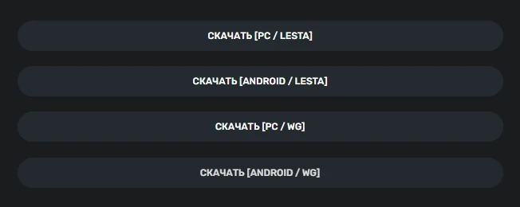
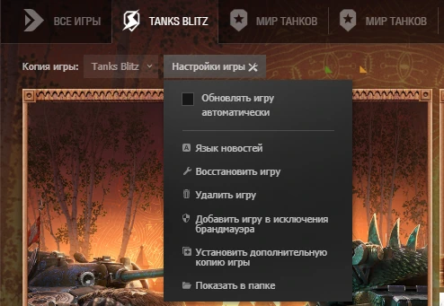
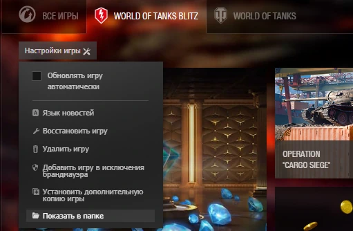
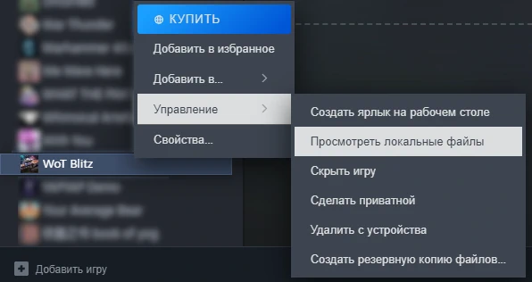
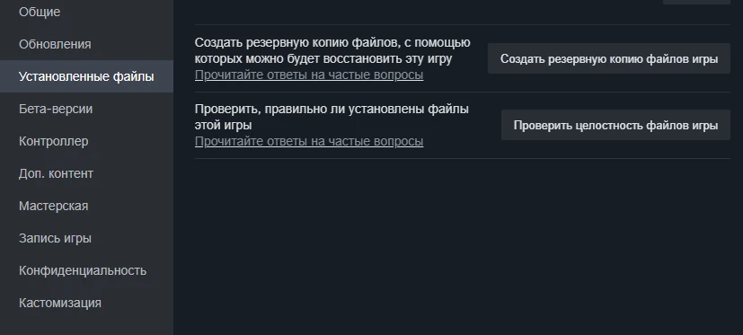

### [< На Главную](../README.md)

---

# 📘 Установка и удаление модов на PC

## Содержание

- [Введение](#введение)
- [Установка модов на PC](#установка-модов-на-pc)
- [Удаление модов на PC](#удаление-модов-на-pc)
- [Заключение](#заключение)

---

## Введение

Если ты взялся читать этот гайд, то заранее готовься к тому, что придётся разбираться. Гайд направлен на то, чтобы затронуть только основные аспекты, а не разбирать каждую мелочь. С спецификой установки свойственной именно вашему девайсу, вы должны разбираться сами!

> [!IMPORTANT]
> 
> В гайде затронуты **все** основые моменты и подсказки где искать ответы. Если вы будете возвращаться с вопросами, которыйе описаны в данном гайде, то вам никто не поможет. Внимательно читайте написанное, удачи!

---

## Установка модов на PC

Установить моды на Tanks Blitz или WoT Blitz на PC довольно просто, основная схема всегда одна и состоит из 3-х этапов:  
1 - Загрузка мода с сайта.  
2 - Поиск корневой папки игры.  
3 - Замена оригинальных файлов.  

### Загрузка мода с сайта

Для начала определитесь, какой мод вы хотите скачать и установить. Внимательно изучите описание мода — там могут быть дополнительные предписания по установке или указания на его особенности. Ниже описания вы увидите несколько ссылок:

  
_Пример ссылок для загрузки на сайте_

Вы должны загрузить именно тот файл, который подходит под ваш клиент и платформу. В нашем случае клиент — это `PC`, а платформа — `WG` или `LESTA`. Когда определились, просто нажимаем на нужную кнопку и загружаем архив.

### Поиск корневой папки игры

Когда вы точно знаете платформу, то на основе этого нужно найти путь до игры. 

#### Для LESTA:

На данный момент на `PC` доступен только `Lesta Game Center`. Чтобы в `LGC` открыть путь до корневой папки игры, следуйте следующим указаниям:  
`Запустите "Lesta Game Center"` → `Нажмите на "Настройки игры"` → `Выберите пункт "Показать в папке"`.

  
_Пример открытия папки игры в Lesta Game Center_

#### Для WG:

На данный момент доступны `Steam` и `Wargaming Game Center`. Чтобы в `WGC` открыть путь до корневой папки игры, следуйте следующим указаниям:  
`Запустите "Wargaming Game Center"` → `Нажмите на "Настройки игры"` → `Выберите пункт "Показать в папке"`.

  
_Пример открытия папки игры в Wargaming Game Center_

Для `Steam` похожий подход:  
`Нажмите правой кнопкой мыши по игре` → `Выберите "Управление"` → `Нажмите "Просмотреть локальные файлы"`.

  
_Пример открытия папки игры в Steam_

После выполненных действий откроется корневая папка игры.

### Замена оригинальных файлов

После того как вы скачали архив с модом, его необходимо распаковать. Для этого вам понадобится архиватор, например [7-Zip](https://github.com/ip7z/7zip/releases/). Извлеките файлы из архива в корневую папку игры, которую вы нашли на предыдущем этапе. При появлении запроса о замене файлов подтвердите действие.

> [!TIP]
> Если предупреждения о замене не появилось, то вероятнее всего вы неправильно установили мод.

**Важно:** для корректной работы **некоторых модов** может потребоваться дополнительная установка файлов в папки от **sDLC**:

- **Для LESTA (LST):** скопируйте файлы мода в папку `Документы/Tanks Blitz/packs`.
- **Для Wargaming (WG):** скопируйте файлы мода в папку `AppData/Local/wotblitz/packs`.

Чтобы быстро перейти в папку `AppData`, нажмите `Win + R`, введите `%localappdata%` и нажмите `Enter`.

После выполнения этих действий мод будет установлен. Запустите игру и проверьте его работу.

---

## Удаление модов на PC

Удаление модов на `PC` обычно производится через принудительное удаление файлов или проверку игровых ресурсов функцией встроенной в `игровые лаунчеры`. 

### Восстановление через игровые лаунчеры

#### Для `Lesta Game Center` и `Wargaming Game Center`:

Чтобы восстановить файлы игры, следуйте следующим указаниям:  
`Запустите "Lesta Game Center"/"Wargaming Game Center"` → `Нажмите на "Настройки игры"` → `Выберите пункт "Восстановить игру"`. Ожидайте окончания проверки и загрузки всех необходимых файлов.

  
_Пример восстановления игры в игровом лаунчере_

#### Для `Steam`:

Откройте `Steam` и проследуйте следующей инструкции: `Нажмите правой кнопкой мыши по игре` → `Нажмите "Свойства"` → `Перейдите во вкладку "Установленные файлы"` → `Нажмите "Проверить целостность файлов игры"`.

  
_Проверка целостности файлов в Steam_

### Ручное удаление файлов модов

> [!WARNING]
> При восстановлении файлов через лаунчеры, от модов могут остаться лишние файлы. Удаление игры через лаунчер не поможет полностью очистить моды, поэтому потребуется ручное удаление файлов с последующим восстановлением по инструкции выше.
> 
> Крайне советую делать полный бекап игры, если вы сомневаетесь в своих навыках или не очень опытный пользователь.

Для полного удаления модов необходимо вручную удалить файлы из следующих папок:

- **Для LESTA (LST):** удалите файлы модов из папки `Документы/Tanks Blitz/packs`
- **Для Wargaming (WG):** удалите файлы модов из папки `AppData/Local/wotblitz/packs`

Чтобы быстро перейти в папку `AppData`, нажмите `Win + R`, введите `%localappdata%` и нажмите `Enter`.

### Полная инструкция по удалению модов:

1. **Восстановите файлы игры** через соответствующий лаунчер (Lesta GC, WGC или Steam)
2. **Вручную удалите файлы модов** из дополнительных папок:
   - `Документы/Tanks Blitz/packs` (для LESTA)
   - `AppData/Local/wotblitz/packs` (для Wargaming)
3. **Перезапустите игру** и убедитесь, что все моды удалены

После выполнения этих действий игра будет полностью очищена от модов и восстановлена в оригинальное состояние.

---

## Заключение

Поздравляю! Теперь ты знаешь всю базовую информацию по установке и удалению модов на PC. Помни: главное — внимательно читать описание модов и следовать инструкциям. 

Если что-то пошло не так — всегда можно воспользоваться функцией восстановления игры через лаунчер. Не бойся экспериментировать, но и не забывай делать бэкапы перед установкой новых модов.
